<center>
<h1>Práctica de SOA</h1>
<h2>Servicios SOAP usando JEE (Glassfish)</h2>
<h3>Arquitecturas y Tecnologías del Software</h3>
<br/>
<h4>Autores</h4>
<b>David Lozano Jarque (NIU 1359958)</b>
<b>Carlos González Cebrecos (NIU 1212586)</b>
<b>Adrián Soria Bonilla (NIU 1360940)</b>
<br/>
Escuela de Ingeniería, Universidad Autónoma de Barcelona
Curso 2016-2017
</center>
<div style="page-break-after: always;"></div>

# Introducción
En esta práctica, aprenderemos a crear y consumir servicios SOA usando el protocolo SOAP con intercambio de mensajes en XML sobre HTTP(S) con la ayuda de las tecnologías J2EE, y en particular, _Glassfish_

## Preparación del entorno
### Instalación de Glassfish
En primer lugar, debemos instalar _Glassfish_ para crear un servidor de aplicaciones de JEE donde lanzar nuestros servicios web SOAP en forma de contenedores Java.

Para ello, nos descargamos la [distribución oficial de Glassfish](https://glassfish.java.net).

<center></center>

A continuación, instalaremos _Glassfish_ en nuestro ordenador descomprimiendo el _.zip_ en un directorio.

> Para este tutorial usaremos una máquina con S.O. Ubuntu 16.04 LTS. Las instrucciones para otros sistemas operativos son semejantes. También damos por supuesto que tenemos Eclipse para JEE y el último JDK instalados correctamente.

<center>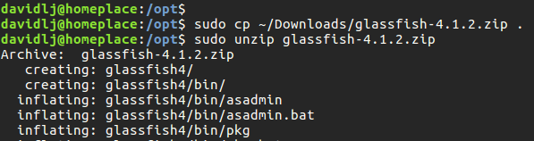</center>

### Integración de _Glassfish_ en _Eclipse_
Ahora debemos controlar la administración del servidor de _Glassfish_ desde _Eclipse_ para facilitar un entorno IDE completamente integrado. Para ello, en la pestaña de _Servers_, en la parte inferior de la pantalla, pulsamos sobre _[...] create a new server..._

<center></center>
> Si la pestaña de _Servers_ no aparece, la podemos hacer aparecer desde el menú principal _Window -> Show View -> Other..._ y buscando _servers_ allí

A continuación, en el tipo de servidor seleccionamos _Glassfish Tools_. En el caso que no tengamos el conector de _Eclipse_ para _Glassfish_ instalado, éste se instalará automáticamente.


<center>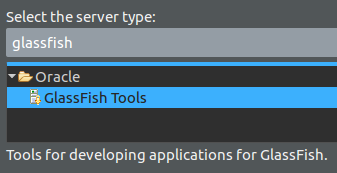</center>

> En el caso de que se cuelgue la instalación o nunca se llegue a completar, podemos instalar el complemento _Glassfish Tools_ para Eclipse dentro del _Eclipse Marketplace_, en el menú _Help -> Eclipse Marketplace_

Creamos un nuevo servidor local con los parámetros por defecto (_localhost_ y nombre _Glassfish at localhost_)

<center>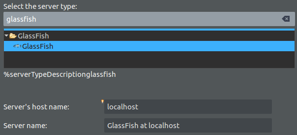</center>

En este paso del tutorial, le indicamos el nombre para referenciar el servidor, la ubicación de _Glassfish_ (dónde descomprimimos anteriormente, la carpeta interna llamada _glassfish_) y finalmente el _JDK_ a usar.
<center>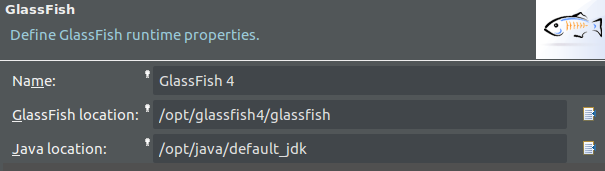</center>

Ahora debemos crear un dominio para lanzar nuestro conjunto de aplicaciones web. Crearemos un dominio llamado _ATS_. Para ello, nos situamos en el directorio `glassfish/bin` dentro del directorio de instalación de _Glassfish_ y ejecutamos el comando `asadmin` para crear un dominio:
```bash
./asadmin create-domain ats
```
<center></center>

A continuación, _Eclipse_ nos pedirá la ubicación del dominio (ubicado dentro de la instalación de _Glassfish_ `glassfish/domains/\<dominio\>`). Por defecto el usuario es `admin` y no hay contraseña.

<center>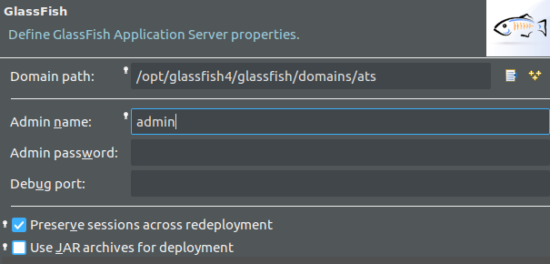</center>
<div style="page-break-after: always;"></div>

## Creando un servicio SOAP y su definición WSDL
### Creación del proyecto para un servicio SOAP
Creamos un nuevo proyecto de _Eclipse_, del tipo _Other_ y en el desplegable, seleccionamos _Dynamic Web Project_ dentro de la categoría _Web_
<center></center>

Especificamos el nombre de proyecto, ubicación del proyecto y si hemos configurado bien el servidor, debería aparecer ya en el seleccionable _Target runtime_ seleccionado por defecto.

<center></center>

En la siguiente pantalla, vemos las carpetas a compilar. La carpeta `src` se compilará por defecto, que es más que suficiente.
<center></center>

Finalmente, especificamos el directorio donde se guardarán los recursos web estáticos (_CSS_, _HTML_, _JS_,...). Pulsamos sobre _Generate web.xml deployment descriptor_ para generar un descriptor de contenidos web a publicar por defecto (los situados en _WebContent_)
<center></center>

### Desarrollo del servicio SOAP
Creamos una nueva clase que contendrá un servicio SOAP, llamado _TestWebService_
<center></center>

En dicha clase, indicamos las anotaciones `@WebService` para indicar que es un servicio web y `@WebMethod` en el método `public String sayHello(String name)` para indicar que es un servicio SOAP a ofrecer que acepta un parámetro (nombre) y devuelve otro parámetro saludando a dicho nombre (ambos de tipo _String_)
<center>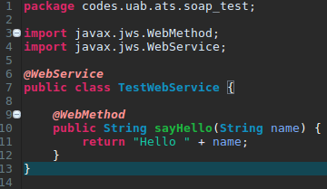</center>

### Publicación de la descripción del servicio SOAP via WSDL
Generamos un fichero _WSDL_ para que clientes puedan consumir nuestro servicio con la operación _sayHello_. Para ello generamos un _WSDL_ que describa este simple _webservice_. Pulsamos clic derecho en nuestro proyecto y _New -> Other..._, allí seleccionamos _Web Service_
<center></center>


En este paso indicamos la clase creada anteriormente como clase que ofrecerá el servicio web y seleccionamos los niveles de configuración del servicio web (seleccionamos que el servicio se comience a ejecutar y no use proxy)

<center>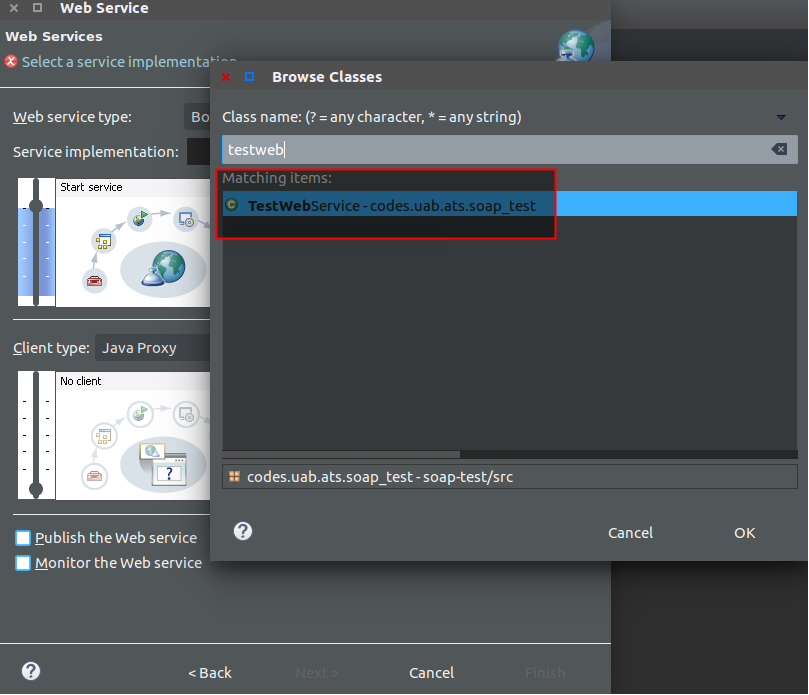</center>

Finalmente, seleccionamos las operaciones a exportar en el WSDL que describe el servicio (en nuestro caso sólo tenemos la operación _sayHello_) y finalizamos el asistente

<center>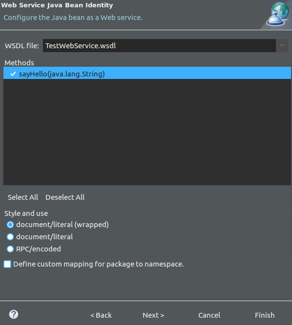</center>

### Puesta en marcha del servidor _Glassfish_ con el servicio SOAP
Para lanzar el servidor _Glassfish_ con nuestra aplicación publicada, clicamos en la pestaña de servidores clic derecho y pulsamos en _Add and Remove..._. Seleccionamos nuestro proyecto y lo añadimos a la lista de _Configured_ pulsando en _Add_.

<center>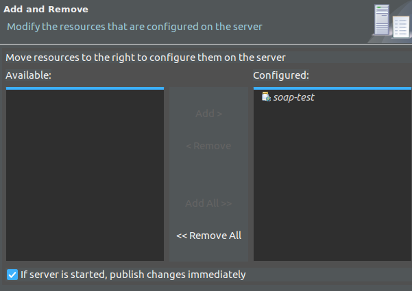</center>

Finalmente, iniciamos el servidor haciendo clic derecho en el servidor y pulsando en _Start_. El resultado será parecido al siguiente (con las indicaciones _Started_ y _Synchronized_)

<center></center>

### Administración del servidor _Glassfish_
Para entrar en el panel de administración web de _Glassfish_, abrimos un navegador y escribimos la siguiente URL:
<center>http://localhost:4848/</center>

Allí podremos ver nuestra aplicación publicada, en le menú de _Common Tasks_, dentro del desplegable _Applications_. Clicamos en ella para ver más detalles
<center>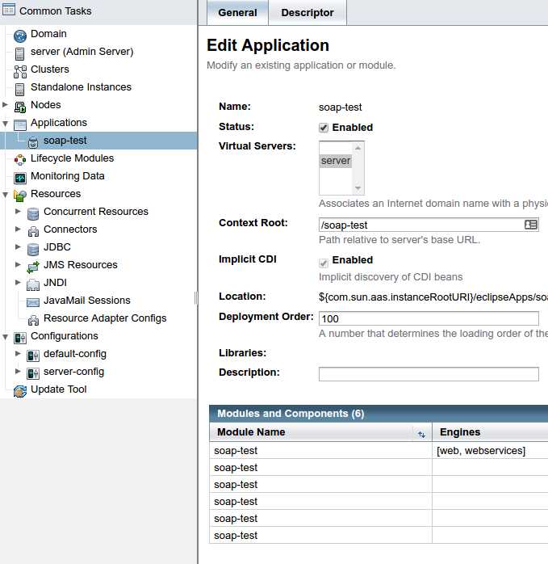</center>

Ahora, buscaremos nuestra URL para obtener el WSDL y consumir nuestro servicio. Podemos verla si clicamos en _View Endpoint_ en el _Endpoint_ de la tabla de módulos y componentes

<center>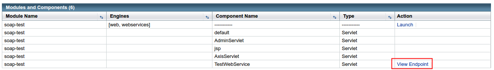</center>

Allí encontraremos la URL para nuestro WSDL. Si pulsamos en él, nos dejará seleccionar la URL segura (HTTPs puerto 8081) e insegura (HTTP 8080) para obtener el WSDL. Seleccionaremos la opción insegura puesto que es un caso de desarrollo / test

<center></center>

> Para aplicaciones en producción, podemos obtener un certificado gratis para nuestro dominio usando _[Let's Encrypt](https://letsencrypt.org)_ y configurarlo en _Glassfish_ a través de esta misma consola de administración con la ayuda de la herramienta de [Java KeyTool](https://docs.oracle.com/javase/6/docs/technotes/tools/windows/keytool.html)

Finalmente, visualizamos el XML que describe en lenguaje WSDL nuestro servicio SOAP.
<center>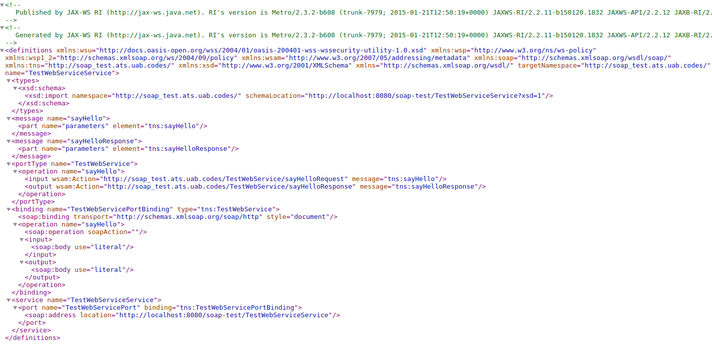</center>

También podemos probar a usar nuestro servicio con el tester integrado cuya URL aparece en la penúltima figura. Aquí probamos nuestro servicio con la operación _sayHello_ a un tal Francisco.
<center></center>

Podemos ver que, en efecto, funciona tal y cómo esperábamos

<center></center>
<div style="page-break-after: always;"></div>

## Consumición de un servicio SOAP usando su WSDL
### Creación del proyecto consumidor de nuestro servicio SOAP
En primer lugar, creamos un proyecto básico de Java usando Eclipse:
<center></center>

Una vez creado, abrimos una terminal, nos situamos dentro del directorio del nuevo proyecto y ejecutamos el comando `wsimport` ofrecido por _Java JDK_ para generar código automático para consumir un SOAP dado un WSDL.

```bash
wsimport -s src -d bin http://localhost:8080/soap-test/TestWebServiceService?wsdl
```

<center>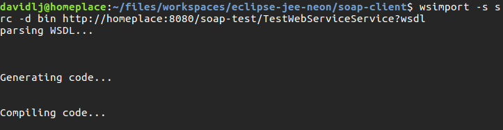</center>

> Si no nos reconoce la herramienta `wsimport`, nos tenemos que asegurar que el directorio `bin` del _JDK_ (_\$JAVA\_HOME_) se encuentra en la variable _PATH_ del entorno.

En el proyecto de _Eclipse_, refrescamos la carpeta `src`, clicando con el botón derecho encima de ella y pulsando en _Refresh_, veremos que se ha generado código para consumir el servicio web SOAP definido por el WSDL introducido en `wsimport`

<center></center>

Creamos una clase cliente que consumirá el servicio SOAP usando el código generado. Marcamos `public static void main(String[] args)` para generar un método principal ejecutable al llamar nuestra aplicación.

<center>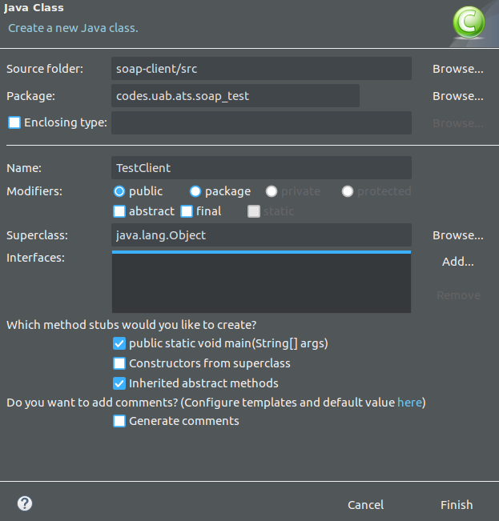</center>

Introducimos el siguiente código en la clase para consumir el servicio. Usamos las clases generadas por `wsimport` para consumir el servicio de forma rápida y efectiva.

<center></center>

Creamos una nueva `Run configuration` en _Eclipse_ del tipo _Java Application_ para compilar y ejecutar el cliente y comprobamos que la respuesta del _webservice_ es correcta.
<center>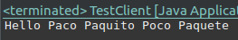</center>

### Monitorizando los mensajes SOAP via HTTP
A continuación vamos a inspeccionar los mensajes que se intercambian el cliente que consume el servicio SOAP y el servidor que lo ofrece. Para ello, en primer lugar, redirigiremos las llamadas para obtener el WSDL hacia el puerto 8081. Esto es porque en el puerto 8081 instalaremos un sniffer que nos ayudará a ver las peticiones que ejecuta (que éste redirigirá al puerto 8080 para continuar con el flujo habitual de comunicaciones).

Realizamos los cambios en el fichero `TestWebServiceService.java`
<center></center>

Ahora, habilitamos el _sniffer_, llamado _TCP/IP Monitor_, pulsando sobre _Window -> Show View -> Other..._ en el menú principal y allí buscando _TCP/IP Monitor_ en la sección _Debug_ del desplegable.

<center></center>

En la nueva pestaña en la sección inferior de la ventana de _Eclipse_ añadimos un nuevo monitor pulsando en la flecha de más opciones en la esquina superior derecha (ver siguiente imagen) y pulsando en `Properties`

<center>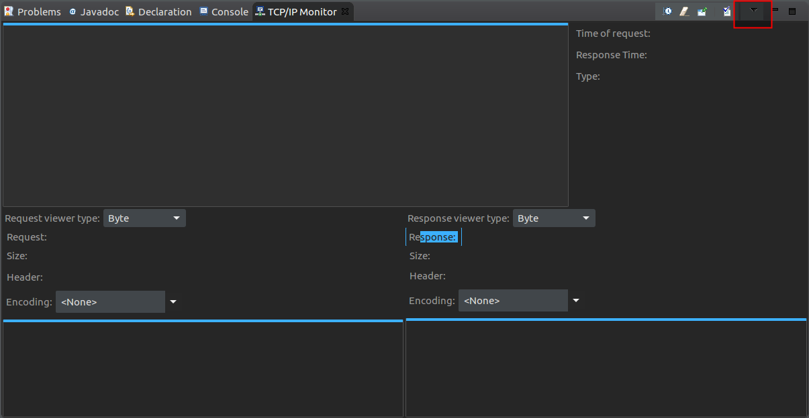</center>

Allí, en la nueva ventana, pulsamos _Add_ para añadir un nuevo monitor y lo definimos para que redirija las peticionse que recibirá en su puerto (_Local monitoring port_) a la misma máquina (_localhost_) en el puerto _Port_ (_8080_). Seleccionamos el tipo _HTTP_ puesto que no nos interesa el bajo nivel de _TCP/IP_.

<center></center>

Añadimos el monitor y hacemos clic en _Start_ para comenzar el monitor.

<center></center>

A continuación, ejecutamos el cliente y veremos que la primera y única petición que aparece es la petición para obtener el WSDL (`GET /soap-test/TestWebServiceService?wsdl`), en cuya respuesta el servidor sirve el WSDL que vimos anteriormente. Los mensajes de _request_ y _response_ de la operación _sayHello_ no aparecen

<center>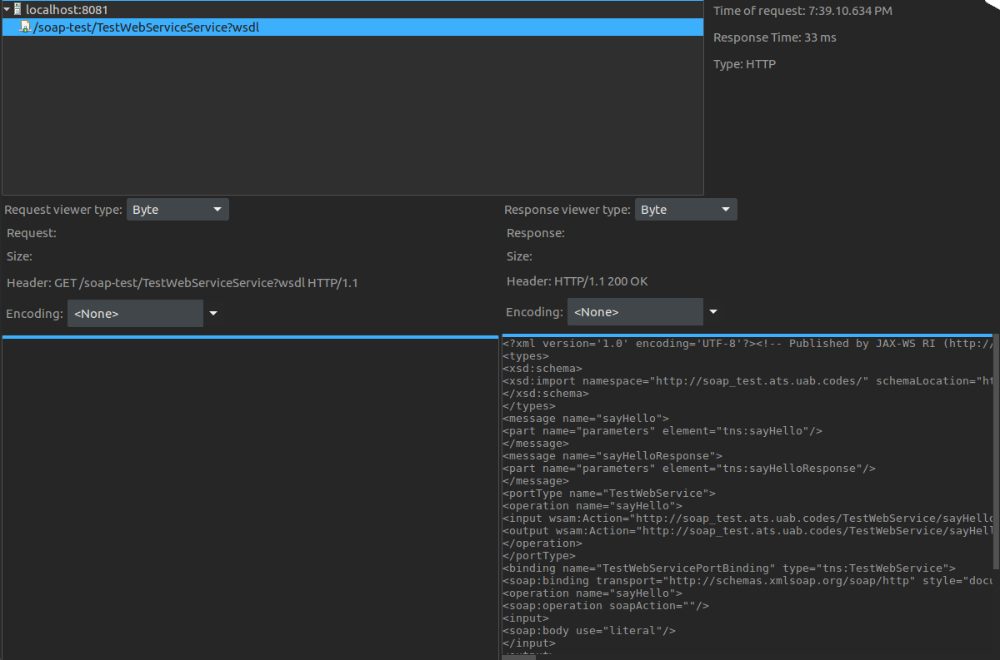</center>

Esto es puesto que al obtener el WSDL, el WSDL indica el puerto 8080 para usar el servicio, por lo que la llamada a la operación _sayHello_ la realiza a dicho puerto y el sniffer no intercepta la petición. Para poder realizar la inspección de las operaciones, debemos cambiar el puerto del WSDL.

Dado que el WSDL en dicha URL se genera dinámicamente, obtendremos el WSDL, lo guardaremos como recurso estático con el puerto cambiado y redirigeremos las llamadas al nuevo WSDL con el puerto cambiado indicando que los servicios se encuentran en el puerto 8081

Volvemos a visitar el WSDL con el navegador y guardamos el fichero en la ubicación `WebContent\wsdl\TestWebServiceService.wsdl`.
<center>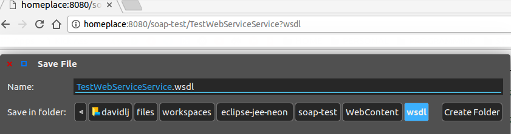</center>

Lo abrimos y cambiamos el puerto de 8080 a 8081 en el fichero que acabamos de guardar.
<center>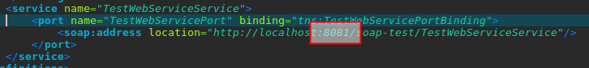</center>

Publicamos los cambios en _Glassfish_ clicando con el botón derecho sobre el servidor y haciendo clic en _Publish_.

Ahora modificamos la URL del WSDL en la clase `TestWebServiceService.java` para que en vez de visitar el WSDL generado dinámicamente, visite el estático que acabamos de guardar, subsituyendo la URL de la cuál cambiamos el puerto de `http://localhost:8081/soap-test/TestWebServiceService?wsdl` hacia `http://localhost:8081/soap-test/wsdl/TestWebServiceService.wsdl`

Ejecutamos de nuevo el cliente SOAP. Ahora ya vemos que el sniffer puede coger las dos peticiones, la del nuevo WSDL y la de la operación _sayHello_. En dicha operación, se hace un _POST_ con el _Envelope SOAP_ que contiene los parámetros a solicitar para la operación y la operación a solicitar y la respuesta contiene el _Envelope SOAP_ con el objeto respuesta a la operación
<center></center>

<center></center>

Visualizamos los resultados en un editor de texto

<center></center>
#### Detalle de los mensajes SOAP
En función de la versión de SOAP que se esté usando en el momento, podemos encontrar los mensajes SOAP situados dentro del tag `<S:Envelope>` `<SOAP:Envelope>`o bien `<S:env>`.

En la petición vemos que en el cuerpo del mensaje soap se solicita la operación `sayHello`, con el argumento `Paco Paquito Poco Paquete` y en la respuesta obtenemos un objeto `sayHelloResponse` con valor de retorno `Hello Paco Paquito Poco Paquete`

### Consumición de un servicio SOAP externo
A continuación crearemos un tercer proyecto para consumir un servicio SOAP público existente, usando las instrucciones para generar nuestro último cliente consumidor de un servicio SOAP.

#### El servicio SOAP
Usaremos un servicio SOAP proporcionado por [WebServiceX](http://webservicex.net) que obtiene la localización geográfica de una dirección IP. Vemos que nos proporcionan el _endpoint_ donde se encuentra el WSDL.
<center>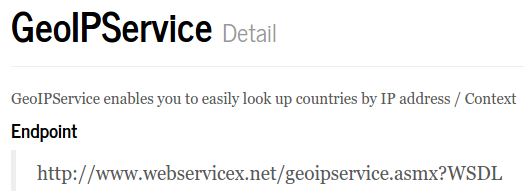</center>
Creamos un nuevo proyecto de Java como en el apartado anterior y usamos el comando `wsimport` dentro de la carpeta de este nuevo proyecto para generar el código que consumirá el servicio.

El comando es el siguiente:
```bash
wsimport -s src -d bin http://www.webservicex.net/geoipservice.asmx?WSDL
```

Refrescamos la carpeta `src` igual que en el anterior apartado y vemos que ya tenemos el código para consumir el servicio.
<center></center>

Creamos una nueva clase y llamámos al servicio, siendo la dirección IP un parámetro del cliente, que nos imprimirá el país y su código identificativo dada una IP que geolocaliza
<center></center>

A continuación creamos una neuva `Run configuration`, del tipo _Java Application_ y indicamos en los parámetros la IP a geolocalizar

<center>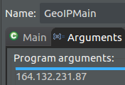</center>

Ejecutamos el cliente y nos devuelve la geolocalización de la IP pasada como argumento.
<center>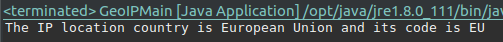</center>

## Repositorio
El código del _webservice_ SOAP que proporciona la operación `sayHello` se encuentra en el siguiente repositorio de _GitHub_:

<center>https://github.com/uab-projects/ats-soap-test</center>

El código del consumidor de dicho _webservice_ se encuentra en el sigiuente repositorio:

<center>https://github.com/uab-projects/ats-soap-client</center>

Finalmente, el código del consumidor del servicio de geolocalización de IPs mediante SOAP se encuentra en el siguiente repositorio:

<center>https://github.com/uab-projects/ats-geoip-client</center>

Esta documentación está presente en formato _Markdown_, _PDF_ y _HTML_ en:

<center>https://github.com/uab-projects/ats-soap-test</center>

En el directorio `docs`, y visible online en la siguiente URL

<center>https://uab.codes/ats-soap-test/</center>
